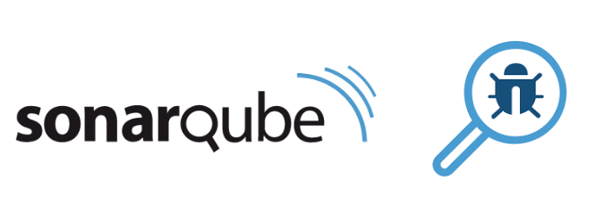

# SonarQube Integration with GitLab CI/CD for Node.js Project

This guide documents how to set up SonarQube using Docker Compose and integrate it into a GitLab pipeline for a Node.js project to enable code quality and static analysis.


---

## 📦 Prerequisites

- GitLab Runner installed and registered
- Docker & Docker Compose installed

---

## 🐳 SonarQube Setup (Docker Compose)

### 1. Create `docker-compose.yml`

```yaml
version: "3"

services:
  sonarqube:
    image: sonarqube:lts-community
    depends_on:
      - sonar_db
    environment:
      SONAR_JDBC_URL: jdbc:postgresql://sonar_db:5432/sonar
      SONAR_JDBC_USERNAME: sonar
      SONAR_JDBC_PASSWORD: sonar
    ports:
      - "9001:9000"
    volumes:
      - sonarqube_conf:/opt/sonarqube/conf
      - sonarqube_data:/opt/sonarqube/data
      - sonarqube_extensions:/opt/sonarqube/extensions
      - sonarqube_logs:/opt/sonarqube/logs
      - sonarqube_temp:/opt/sonarqube/temp

  sonar_db:
    image: postgres:13
    environment:
      POSTGRES_USER: sonar
      POSTGRES_PASSWORD: sonar
      POSTGRES_DB: sonar
    volumes:
      - sonar_db:/var/lib/postgresql
      - sonar_db_data:/var/lib/postgresql/data

volumes:
  sonarqube_conf:
  sonarqube_data:
  sonarqube_extensions:
  sonarqube_logs:
  sonarqube_temp:
  sonar_db:
  sonar_db_data:
```
### 2. Start the containers
```bash
docker-compose up -d
```

### 3. Access the SonarQube Dashboard
Open your browser and navigate to:
http://localhost:9001
Default credentials: (**Username: admin & Password: admin**)

Change the password when prompted.

---
## Create a personal access token in GitLab 
Create a personal access token in GitLab for authenticating SonarQube with GitLab.

## ⚙️ SonarQube Project Configuration

### 1. Project Creation in SonarQube
1.In SonarQube, go to **Administration => Configuration => ALM Integration => GitLab**

2.Click on Create Configuration.

3.Give any Configuration name (gitlab), enter https://gitlab.com/api/v4 as GitLab API URL, and enter the Personal Access token generated in GitLab.

**After saving the configuration, we can see configuration is valid.**

4.Now add a project in SonarQube and select From GitLab.

5.In the next step enter personal access token generated in GitLab.

6.In the next step we can see the project of our GitLab and click on Set up .

7.In the next step select With GitLab CI.

8.In the next step we can select the language or the framework with respect to our source code.

9.Create a file name **sonar-project.properties** in GitLab Project and save the code provided in the next step in SonarQube.

10.Now in next step, click on Generate a token. Add variable in GitLab named **SONAR_TOKEN** and give the token generated as values. Uncheck the “Protect variable” checkbox and check the “Mask variable” checkbox.

11.Add another variable in GitLab named **SONAR_HOST_URL** and provide the value given in SonarQube. Uncheck the “Protect variable” checkbox.

**sonar-project.properties**
In your Node.js project root:

```properties	
sonar.projectKey=your-project-key
sonar.qualitygate.wait=true
sonar.projectVersion=<verison>

# Source and test configuration
sonar.sources=src
sonar.tests=tests
sonar.test.inclusions=tests/**/*.spec.ts

# Coverage report
sonar.typescript.lcov.reportPaths=coverage/lcov.info
```

---
## 🤖 GitLab CI/CD Integration 

### 1. Install SonarScanner (if needed)

### 2. .gitlab-ci.yml
Add the .gitlab-ci.yml file in GitLab project for continuous integration.
```yaml	
code-coverage:
  stage: test
  script:
    - npm install
    - npm run coverage 
    - npm run cover:report 
  artifacts:
    paths:
      - coverage/lcov.info
    expire_in: 1 week
  allow_failure: true
  only:
    - merge_requests
    - main
    - develop 

sonarqube-check:
  stage: test
  dependencies:
    - code-coverage
  variables:
    SONAR_USER_HOME: "${CI_PROJECT_DIR}/.sonar"  # Defines the location of the analysis task cache
    GIT_DEPTH: "0"  # Tells git to fetch all the branches of the project, required by the analysis task
  cache:
    key: "${CI_JOB_NAME}"
    paths:
      - .sonar/cache
  script: 
    - sonar-scanner
  allow_failure: true
  needs:
    - code-coverage 
  only:
    - merge_requests
    - main
    - develop
```
**Make sure the SonarQube instance is accessible from  GitLab runner.**

We can see the detailed analysis of code in SonarQube project.
---